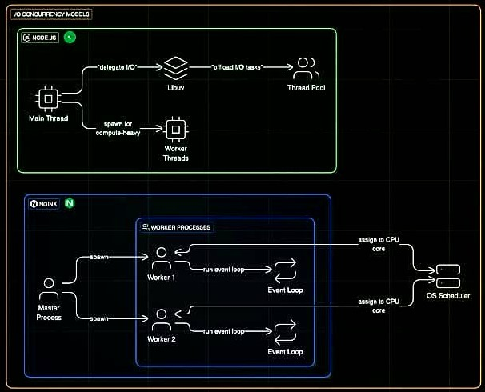

# 🚀 NGINX 🚀

> **Pronunciation:** "Engine-X"

## 🔍 What is Nginx?

Nginx is a powerful web server that uses a **non-threaded, event-driven architecture** designed for high performance and efficiency.

## ✨ Key Features

### 🔄 Load Balancing
Distributes network traffic across multiple servers to ensure no single server becomes overwhelmed.

### 📦 HTTP Caching
Stores copies of frequently accessed resources to reduce server load and improve response times.

### 🛡️ Reverse Proxy
Acts as an intermediary between clients and servers, providing enhanced security and performance.

## 💪 Performance

Nginx can handle **10,000+ concurrent connections** with minimal resource usage, making it perfect for high-traffic websites and applications.

---

---
###### you can run nginx in the docker.

# 🚀 Nginx vs Caddy: A Delightful Comparison

Choosing a web server? 🤔 Let's break down the **battle between Nginx and Caddy** in a simple and fun way!

| Feature 🚩               | **Nginx** 🧱                                   | **Caddy** 🍃                                     |
|--------------------------|-----------------------------------------------|--------------------------------------------------|
| 🛠️ **Installation**      | Manual setup, config-heavy                    | One-liner install, config-light                 |
| 🔐 **HTTPS (SSL)**       | Manual via Let's Encrypt or certbot           | Automatic HTTPS out of the box 💚               |
| 📄 **Configuration File**| Nginx config (`.conf`) — verbose              | Caddyfile — clean and human-friendly ✨         |
| ⚡ **Performance**        | High-performance, battle-tested               | Also high-perf, but slightly newer on the block |
| 📦 **Built-in Features** | Reverse proxy, load balancing, gzip, etc.     | All that **+** auto HTTPS, HTTP/3, Prometheus   |
| 👶 **Ease of Use**       | Learning curve required                       | Beginner-friendly                              |
| 🧠 **Configuration Style**| Declarative (more complex)                   | Declarative but simpler and more intuitive      |
| 💻 **Dev Experience**    | Powerful, but can get complex fast            | Smooth and fast for small to medium projects    |
| 🔁 **Hot Reload**        | Needs manual reload or extra tool             | Auto-reloads on config change 🔥                |
| 🧩 **Extensibility**     | Modules available, some 3rd party             | Pluggable with Go, great plugin system          |
| 💰 **License**           | Open-source (BSD-like license)                | Apache 2.0 (open-source + commercial options)   |

---

## ✨ Key Highlights

- **Caddy** is like the cool new friend who does *a lot* without being asked — **automatic HTTPS** and **super simple setup**.
- **Nginx** is the seasoned warrior — powerful and customizable, but expects you to handle the sharp swords (configs 🗡️) yourself.

---

## 🤔 When to Choose What?

- ✅ **Choose Nginx if**:
  - You need deep control over traffic.
  - You're working with legacy systems.
  - You're scaling to massive workloads and want max optimization.

- 🌱 **Choose Caddy if**:
  - You want **zero-hassle HTTPS**.
  - You're deploying personal sites or internal tools.
  - You love simplicity with power.

---

## 💬 Final Words

Both are excellent — it's just a matter of **what kind of journey** you're on.
Go with **Nginx** for tradition and power.
Go with **Caddy** for comfort and modern vibes.

> 🌟 Happy Hosting!
> 🌐 Happy Learning!